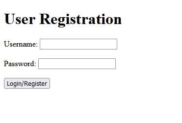
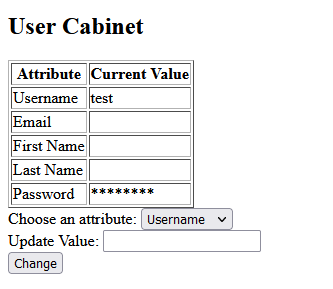
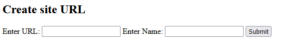
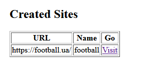
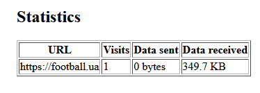
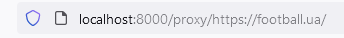

A test task for SheepFish: A Django Proxy app.

To run the app you need to clone the repository via `git clone https://github.com/denys-kovalchuk/SheepFish.git`, run Docker build using `docker build -t sheepfish .`.
After the app is built, run `docker run -p 8000:8000 sheepfish` to run the docker image on port 8000. After that you can register at http://localhost:8000/. 

1. User registration allows users to login/register from the same form:

2. The user cabinet provides all the info about the user and allows to change some basic info:
   

3. Then a user can create sites they want to visit later:
   

4. Created sites are shown in a table. To visit a site click 'Visit':
   

5. Visits are gathered in the 'Statistics' section:
   

6. Every site is opened via 'proxy' - http://localhost:8000/proxy/{site URL}:
    

7. The site is fully operational, and a user can navigate freely:
    

